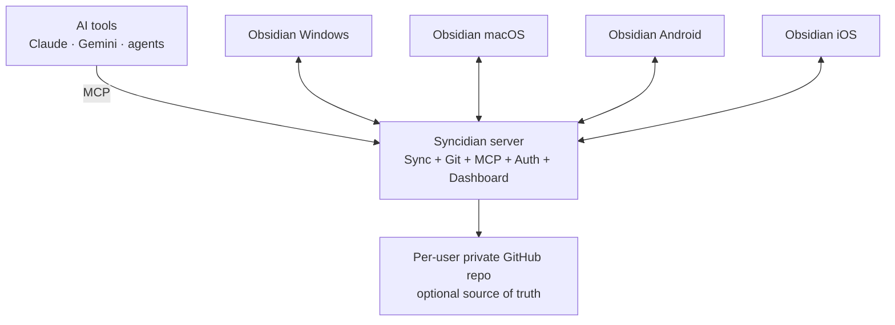
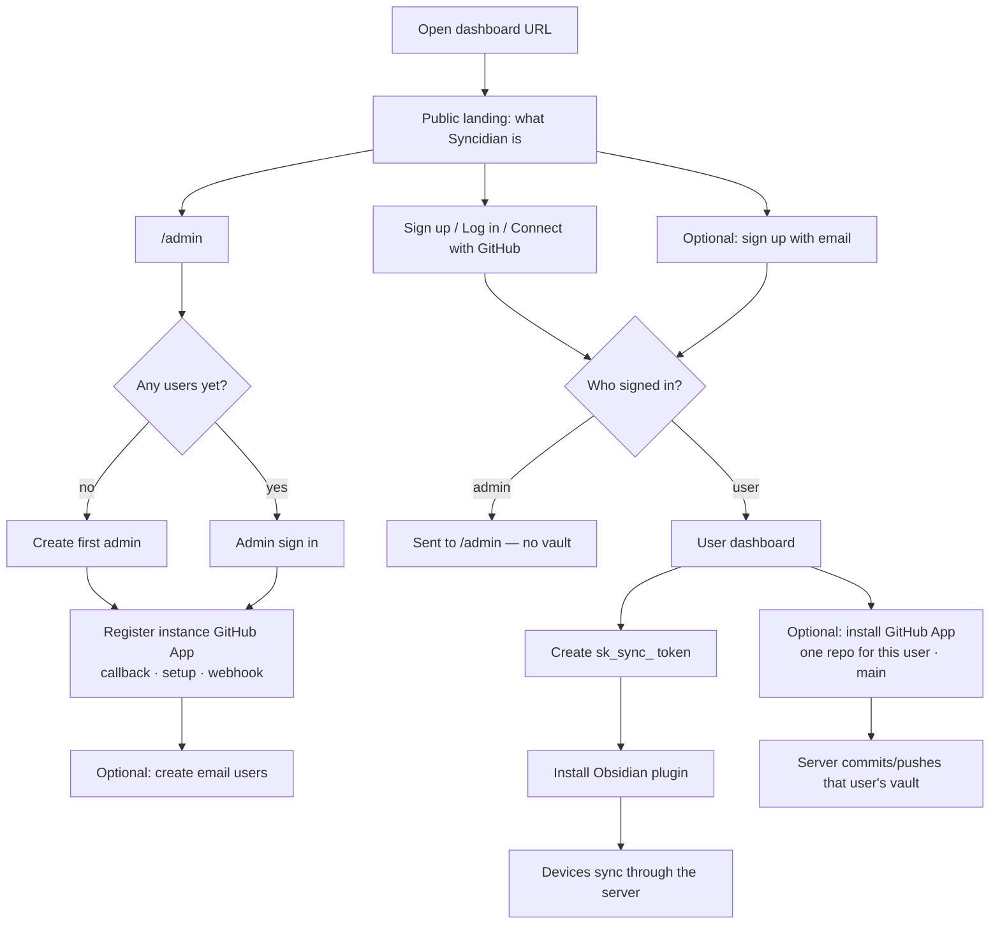
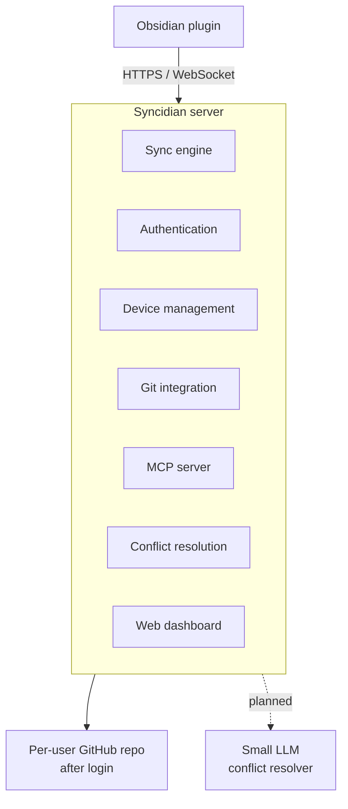
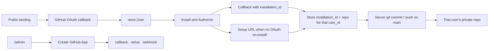
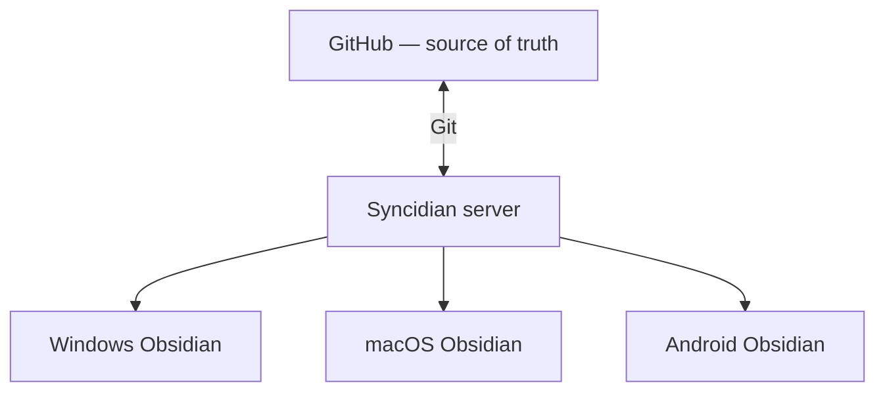
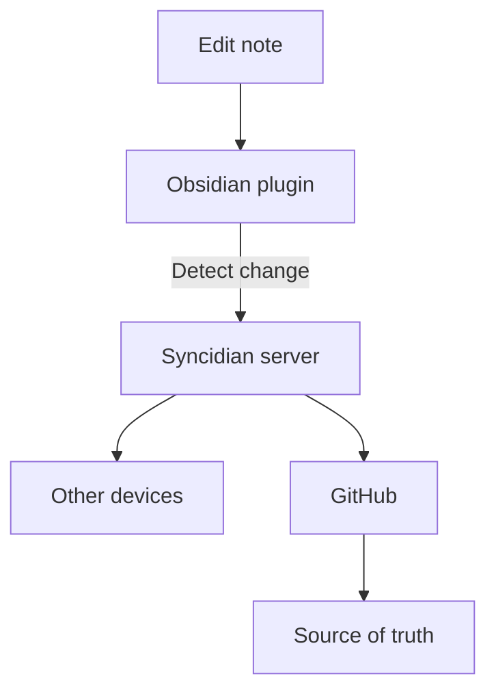
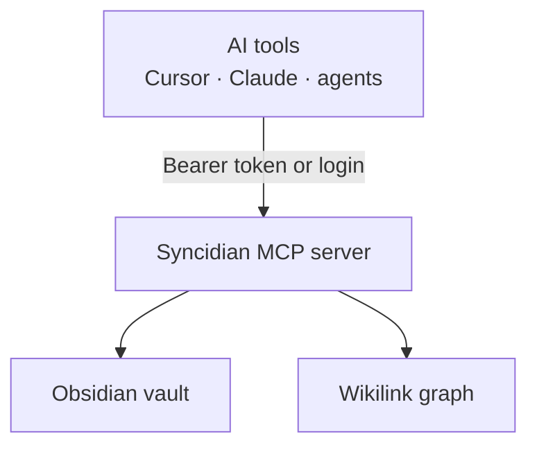

# Syncidian

> **Sync your knowledge. Back it up. Connect your AI. Own your data.**

**Obsidian plugin:** install **Syncidian** from Community plugins (or [BRAT](https://github.com/TfTHacker/obsidian42-brat) / sideload). Point it at your Syncidian server with a `sk_sync_…` token. This plugin does not use Obsidian Sync.

Syncidian is an open-source, self-hostable **Obsidian synchronization and AI bridge**.

It runs as an Obsidian plugin on your devices and connects to a lightweight Syncidian server that coordinates synchronization between them.

Each signed-in user can connect **one private GitHub repository**. GitHub is the durable, versioned **source of truth** for that user's vault. The public site is a one-page story: sign in with GitHub, optionally sign up with email, then connect one repository. Operators use `/admin` (for example `https://syncidian.example.com/admin`). Admins manage users and the instance GitHub App, and never see vault or GitHub data.

Syncidian also includes a built-in **MCP server**, allowing compatible AI tools and agents to securely interact with your Obsidian knowledge base.

The server is designed to be written in **Go** and deployed with a simple **Dockerfile**, making self-hosting as easy as:

```bash
docker build -t syncidian .
docker run -d \
  --name syncidian \
  -p 8080:8080 \
  syncidian
```

**Self-host Syncidian for free, or use the upcoming hosted service starting at $1/month.**

---

# 🚀 Quick start (Mac, Linux, or Windows with Docker)

This repository is ready to run. Clone it, start the server, install the Obsidian plugin, and sync.

## 1. Start the server

**With Docker (recommended):**

```bash
git clone https://github.com/shangeethsivan/Syncidian.git
cd Syncidian
docker compose up --build -d
```

Open [http://localhost:8080](http://localhost:8080). The public page explains Syncidian and lets people **Sign up using GitHub**. Operators open [`/admin`](http://localhost:8080/admin) to create the first admin and register the GitHub App. Follow [Set up the GitHub App](docs/github-app.md) if you are self-hosting. A **Help** button on `/admin` and the signed-in dashboard walks through the rest. After GitHub sign-in, a regular user connects **one GitHub repository**, then creates an access token (`sk_sync_…`). Admins can also mint a one-time token for a vault user from **Users** (they still cannot sync as admin). Copy the token once — it is not shown again.

**Without Docker (Go 1.22+):**

```bash
go run ./cmd/syncidian serve
```

Data is stored in `./data` by default (`SYNCIDIAN_DATA` to change it). Docker Compose persists it at `/data` via a named volume (not a Dockerfile `VOLUME`, which Railway and some builders reject). **Without that volume, a new deploy starts with an empty database** — no users, no GitHub App, empty vaults.

### Deploy on Railway

Users, GitHub App credentials, and vault files live in SQLite on disk. Railway’s container filesystem is **empty on every deploy** unless you attach a volume.

1. New project → deploy this GitHub repo. Railway builds the `Dockerfile`.
2. **Settings → Volumes → Add volume**, mount path **`/data`**. Do this before creating the admin or registering the GitHub App. `railway.json` sets `requiredMountPath` to `/data` so a deploy without a volume fails instead of silently resetting the instance, and `overlapSeconds` to `0` so two replicas do not share SQLite during a rollout.
3. Generate a public domain. The server listens on Railway’s `PORT` and uses `RAILWAY_PUBLIC_DOMAIN` for the dashboard URL unless you set `SYNCIDIAN_PUBLIC_URL`.
4. Optional variables: `SYNCIDIAN_BOOTSTRAP_USER`, `SYNCIDIAN_BOOTSTRAP_PASSWORD`. To keep the GitHub App if the volume is missing, also set `SYNCIDIAN_GITHUB_APP_*` (see [Set up the GitHub App](docs/github-app.md)). Set `SYNCIDIAN_DATA_KEY` (32-byte hex) so GitHub App secrets stay encrypted even if `syncidian.db` is copied off the volume.
5. Open the public URL. Create the admin at `/admin`, then register the GitHub App ([walkthrough](docs/github-app.md)). `/admin` warns if the data directory is still ephemeral. Let people sign in with GitHub from the public site. Point the plugin at that URL with that user's token.

Health check: `GET /health`.

## 2. Install the Obsidian plugin

You still run a Syncidian server (step 1). The plugin is only the Obsidian client.

**From Community plugins** (easiest, once listed):

1. Settings → Community plugins → turn **Restricted mode** off.
2. Browse → search **Syncidian** → Install → Enable.
3. Settings → Syncidian:
   * Server URL: `http://localhost:8080` (or your deployed URL)
   * Access token: the `sk_sync_…` value from the dashboard
   * Device name: e.g. `MacBook Pro`
4. Click **Connect**.

**If it is not listed yet**, install [BRAT](https://github.com/TfTHacker/obsidian42-brat), then add `shangeethsivan/Syncidian` (needs a GitHub Release whose tag matches `manifest.json` `version`).

**Sideload** from this repo (desktop, or copy the same folder onto a phone):

Syncidian is a **mobile-capable** community plugin (`isDesktopOnly: false`). It does **not** use Node.js, Electron, or a local Git binary — that is why [Obsidian Git](https://github.com/denolehov/obsidian-git) and similar plugins never run on Android or iOS, and why this one can.

```bash
# from this repository
chmod +x scripts/install-plugin.sh
./scripts/install-plugin.sh "/path/to/YourVault"
```

On a Mac this is often something like:

```bash
./scripts/install-plugin.sh "$HOME/Documents/Obsidian/MyVault"
```

Or copy these files by hand into `{Vault}/.obsidian/plugins/syncidian/`:

* `plugin/manifest.json`
* `plugin/main.js`
* `plugin/styles.css`

Then Settings → Community plugins → turn **Restricted mode** off → enable **Syncidian** → Connect as above.

Repeat the token (and install, if you sideloaded) on each device (Windows, Mac, Android, iOS). Create one token per person; the same user can register many devices.

### Android and iOS

The plugin is **not desktop-only**. Unlike Git community plugins, it does not use Node.js, Electron, or a local `git` binary, so it loads on phones.

Copy the same three files into the vault on the device (Files app, iCloud, USB, Syncthing, or a vault that already has them from desktop), or install from Community plugins / BRAT on the phone. Turn Restricted mode off and enable **Syncidian**.

On a phone, **Server URL must be a public `https://` address** (your Railway domain or similar). `http://localhost:8080` is the phone itself, not your computer. iOS often blocks plain `http://`. Details: [`plugin/README.md`](plugin/README.md).

## 3. Optional: GitHub backup (per user)

Create **one GitHub App for this instance** before people sign in with GitHub. Step-by-step: [Set up the GitHub App](docs/github-app.md).

Short version: open `/admin` → **Create GitHub App**, or set `SYNCIDIAN_GITHUB_APP_*`. Then people click **Sign up using GitHub** or **Connect to your GitHub repository** on the public site. After identity, they install the app on **one** repository. Syncidian always uses the **main** branch — other branches are not supported. Personal access tokens and deploy keys are not used. That repository is bound to **that user only**. Admins do not connect a vault repo and cannot see another user's repo or GitHub App credentials. The plugin never needs GitHub credentials. Until that user connects GitHub, their devices still sync through the server.

## 4. Optional: MCP / AI

Dashboard → **MCP / AI** sets tool permissions (search/read on by default). Point an MCP client at:

```text
POST http://localhost:8080/mcp
Authorization: Bearer sk_sync_…
```

Create a token on the **Tokens** page, or exchange a password for one:

```text
POST http://localhost:8080/api/v1/mcp/login
{"username":"you","password":"…"}
```

Dashboard session cookies also work on `/mcp`. Tools cover search, graph/backlinks, create/update/append, and bulk organize when permissions allow.

---

# 📦 Publishing the Obsidian plugin

Obsidian’s community directory reads **`manifest.json` at the repository root** (kept in sync with `plugin/manifest.json`). Users install `main.js`, `manifest.json`, and `styles.css` from a GitHub Release whose **tag matches** that `version` exactly (`0.1.0`, not `v0.1.0`).

This repo is set up for that:

1. Edit the plugin under `plugin/`. After a version bump, copy metadata to the root:

   ```bash
   make plugin-manifest
   ```

2. Push an annotated tag matching `plugin/manifest.json` `version`. `.github/workflows/release.yml` builds the plugin, attests the artifacts, and publishes the three files on a GitHub Release:

   ```bash
   git tag -a 0.1.0 -m "0.1.0"
   git push origin 0.1.0
   ```

3. Submit (or update) the listing at [community.obsidian.md](https://community.obsidian.md): sign in with your Obsidian account, link GitHub, and add this repository (`shangeethsivan/Syncidian`). The directory uses the root `manifest.json` on the default branch; the `id` is `syncidian`.

4. Address automated review feedback, then bump the version and tag again. After approval, people install from Community plugins → Browse → **Syncidian**.

Until that listing is live, testers can use [BRAT](https://github.com/TfTHacker/obsidian42-brat) pointed at this GitHub repo (after the first tagged release) or `scripts/install-plugin.sh`. Keep `isDesktopOnly` **false** so Android and iOS can install it. Mobile review notes: [`docs/community-plugin.md`](docs/community-plugin.md).

Rebuilding the plugin after TypeScript changes:

```bash
cd plugin && npm install && npm run build
```

`plugin/main.js` is the compiled artifact Obsidian loads. Commit it so people can sideload without Node.js.

---

# ✨ What is Syncidian?

Syncidian brings three capabilities together:

* 🔄 **Sync** — Synchronize your Obsidian vault across devices.
* 🐙 **Backup** — Use a private GitHub repository as the durable source of truth.
* 🤖 **AI** — Connect your knowledge base to AI tools through MCP.

The goal is simple:

> **Your Obsidian vault should belong to you, be backed up by you, and be accessible to the AI tools you choose.**

---

# 🧠 The Vision

Syncidian isn't just another file synchronization tool.

The long-term goal is to make synchronization almost invisible.



Eventually, Syncidian should be able to detect a conflict, have a small LLM resolve it automatically, validate the result, commit it to GitHub, and propagate the resolution to every device.

> **Let AI handle the boring conflicts. Let humans handle the important ones.**

---

# 🗺️ App workflow

The public site is a one-pager. Vault users sign in with GitHub (or email). Operators use `/admin`.



When this workflow changes, update this diagram, [`docs/architecture.md`](docs/architecture.md), and follow [`AGENT.md`](AGENT.md).

---

# 🏗️ Architecture

Syncidian separates the system into four major components. GitHub renders the chart below; full sync, auth, MCP, and data-model diagrams live in [`docs/architecture.md`](docs/architecture.md).



---

# 🔌 Obsidian Plugin

Syncidian lives inside Obsidian as a plugin.

There is no separate sync application that the user needs to manually operate.

The plugin handles:

* Detecting vault changes
* Sending changes to the Syncidian server
* Fetching changes
* Registering the device
* Detecting conflicts
* Showing conflict resolution UI
* Connecting to MCP
* Reporting client status
* Reporting synchronization state

The user configures the plugin once.

After that, Syncidian works automatically in the background.

---

# 💻 Supported Platforms

Syncidian is designed to work wherever Obsidian plugins are supported.

### Desktop

* 🪟 Windows
* 🍎 macOS
* 🐧 Linux

### Mobile

* 🤖 Android
* 📱 iOS

The plugin is **not** desktop-only. It uses the Obsidian Vault API and `requestUrl` so it loads on phones; Git community plugins that depend on Node or a local `git` binary cannot. On Android and iOS, point the plugin at a public HTTPS server URL (not `localhost`).

The goal is to maintain one consistent synchronization experience across all supported platforms.

---

# ⚙️ Setup

Syncidian is designed around a **server-first configuration model**.

The Obsidian plugin should require as little configuration as possible.

## 1. Deploy Syncidian Server

Run Syncidian on your own infrastructure.

The simplest deployment is Docker Compose from this repository:

```bash
docker compose up --build -d
```

Equivalent one-container flow:

```bash
docker build -t syncidian .
docker run -d \
  --name syncidian \
  -p 8080:8080 \
  -v syncidian-data:/data \
  syncidian
```

A future release should also provide a pre-built Docker image so users can simply run:

```bash
docker run -d \
  --name syncidian \
  -p 8080:8080 \
  ghcr.io/<owner>/syncidian:latest
```

---

# 🐳 One-Command Deployment

The goal is for Syncidian to be deployable with minimal infrastructure knowledge.

Eventually:

```bash
docker run -d \
  --name syncidian \
  -p 8080:8080 \
  -v syncidian-data:/data \
  ghcr.io/<owner>/syncidian:latest
```

The container should provide the complete Syncidian server:

* API
* Sync engine
* Authentication
* GitHub integration
* MCP server
* Web dashboard
* Device management
* Conflict resolution
* Health checks

No separate services should be required for the basic deployment.

---

# 🐙 Configure GitHub

GitHub identity lives on the public site. GitHub **backup** is still **per user**, not a shared vault.

**Self-hosting?** Use the full walkthrough: **[Set up the GitHub App](docs/github-app.md)**. That page is the operator README for creating the app, filling GitHub’s callback / setup / webhook URLs, and wiring credentials.

The public landing never asks for a repository name. It sends people through GitHub OAuth, then the GitHub App setup URL. The Obsidian plugin does not need GitHub credentials. Admin login at `/admin` registers the instance App and does not connect a vault repo.

## Create the GitHub App

You need one App **per Syncidian instance**, not per vault user.

### From the dashboard (recommended)

1. Deploy Syncidian so `{base}` is the URL you will keep (`https://syncidian.example.com` or `http://localhost:8080`).
2. Open `{base}/admin` and create the first admin.
3. Click **Create GitHub App**. GitHub opens with permissions and URLs already filled in.
4. Click **Create GitHub App** on GitHub. You return to `/admin` with the app **Registered**.

### By hand

1. [New GitHub App](https://github.com/settings/apps/new).
2. Paste the three URLs below (also listed on `/admin` and `GET /api/v1/github/app/urls`).
3. Repository permissions: **Contents** read and write, **Metadata** read. Account permissions: **Email addresses** read.
4. Enable **Request user authorization (OAuth) during installation**.
5. If other GitHub users on this instance must install the app on their own accounts, allow installation on **Any account**.
6. Copy App ID, slug, Client ID, a new client secret, and a generated private key (`.pem`).
7. Set `SYNCIDIAN_GITHUB_APP_ID`, `SYNCIDIAN_GITHUB_APP_SLUG`, `SYNCIDIAN_GITHUB_CLIENT_ID`, `SYNCIDIAN_GITHUB_CLIENT_SECRET`, and `SYNCIDIAN_GITHUB_APP_PRIVATE_KEY`, then restart. Put literal `\n` in the PEM env value for newlines.

Then each vault user signs in from `/` and installs the app on one repository (`main` only). Details, localhost notes, and a failure checklist are in [docs/github-app.md](docs/github-app.md).

## GitHub App URLs

When you create the GitHub App (from `/admin` → **Create GitHub App**, or by hand), GitHub asks for these. Open this instance at its public hostname and copy them from the admin page, or from `GET /api/v1/github/app/urls`.

Replace `{base}` with your public URL, for example `https://syncidian.example.com`:

| GitHub field | URL | Why |
| --- | --- | --- |
| **Callback URL** / User authorization callback URL / redirect URI | `{base}/api/v1/auth/github/callback` | GitHub sends people here after **Sign in with GitHub**, and after **Install & Authorize** when OAuth during installation is enabled. Syncidian binds `installation_id` here in that case. |
| **Setup URL** | `{base}/api/v1/github/app/setup` | Used when OAuth during installation is off. GitHub sends people here after they **install** the app so Syncidian can bind that installation. |
| **Webhook URL** | `{base}/api/v1/github/app/webhook` | GitHub requires a webhook URL so it can **ping** the app when you create or update it. Syncidian answers that ping with HTTP 200 even if you do not subscribe to extra events. |

Optional env vars if you prefer not to use the in-dashboard manifest flow: `SYNCIDIAN_GITHUB_APP_ID`, `SYNCIDIAN_GITHUB_APP_SLUG`, `SYNCIDIAN_GITHUB_CLIENT_ID`, `SYNCIDIAN_GITHUB_CLIENT_SECRET`, `SYNCIDIAN_GITHUB_APP_PRIVATE_KEY`. See [docs/github-app.md](docs/github-app.md) for exact GitHub UI fields and Docker examples.

Rules:

* **Public landing, admin at `/admin`.** Create the first admin and the GitHub App at `/admin`. Vault users sign in with GitHub (or email) from `/`.
* **One repository per user.** `github_config` is keyed by `user_id`.
* **GitHub App only.** Connect with GitHub, install on a repository, Contents read and write. No personal access tokens and no deploy keys.
* **Main branch only.** Syncidian always uses `main`.
* **Admin does not need repo sync.** Admins only manage users (username + role) and the instance App. They do not see vaults, tokens, activity, or per-user GitHub credentials.
* **Optional backup.** Devices still sync through the server if a user has not connected GitHub.



```text
Syncidian Server
 ├── Admin — manage users only
 ├── User A — one GitHub repo
 └── User B — one GitHub repo
```

This keeps GitHub credentials on the server and scoped to the account that entered them.

---

# 👤 Create a User

The Syncidian server can support multiple users.

Each user can have:

* Multiple devices
* Access tokens
* A configured vault
* A GitHub repository
* Synchronization history

Example:

```text
Syncidian Server

User A
 ├── Windows
 ├── macOS
 └── Android

User B
 ├── Windows
 └── iOS

User C
 └── macOS
```

Users are isolated from one another.

---

# 🔑 Access Tokens

Once a vault user exists, the server generates an access token.

```text
sk_sync_********************************
```

The token is used by the Obsidian plugin to authenticate with the Syncidian server.

Create one from the user’s **Tokens** page, or as an admin via **Users → Create Obsidian token** (shown once). Admins cannot use tokens themselves.

The token should provide access only to the user's configured resources.

Future authentication options may include:

* Personal access tokens
* Device-specific tokens
* Token rotation
* Token revocation
* OAuth
* Passkeys
* SSO

---

# 🔌 Configure the Obsidian Plugin

Install **Syncidian** from Community plugins (or BRAT / sideload), then open Settings → Syncidian.

The plugin configuration should remain intentionally small:

```text
Syncidian
────────────────────────────────

Server URL
https://sync.example.com

Access Token
••••••••••••••••••

Device Name
MacBook Pro

[ Connect ]

Status: ● Connected
```

The client does **not** require:

* GitHub credentials
* GitHub repository configuration
* Git credentials
* Manual Git commands

---

# 🚀 Activate

Once the plugin authenticates successfully:

1. Register the device.
2. Connect to the Syncidian server.
3. Identify the user's sync group.
4. Check the current source of truth.
5. Determine local changes.
6. Fetch required changes.
7. Start monitoring the vault.
8. Begin synchronization.

Repeat the process on other devices.

---

# 🔄 Synchronization

The Syncidian server is the **coordination layer**.

GitHub is the **primary source of truth**.



The server coordinates changes between clients and synchronizes the durable state with GitHub.

---

# 📝 Editing a Note

When a user edits a note:



The user does not need to manually:

* Commit
* Push
* Pull
* Refresh
* Trigger sync

The plugin handles this automatically. Edits are queued until typing stops, then pushed after a 3 second idle. Simple replacements merge on their own; large conflicts still open a resolver. Deleting or moving a folder (or file) is synced as a Git delete or rename so a later sync does not restore the old path.

---

# 🚀 Opening Obsidian

Whenever Obsidian starts:

```text
Open Obsidian
      │
      ▼
Syncidian Plugin Starts
      │
      ▼
Authenticate
      │
      ▼
Connect to Syncidian
      │
      ▼
Check GitHub
      │
      ▼
Compare Local State
      │
      ▼
Fetch / Merge / Sync
      │
      ▼
Vault Ready
```

The goal is:

> **Open Obsidian and start working.**

Synchronization should happen automatically in the background.

---

# ⚔️ Conflict Resolution

Conflicts happen when the same file is modified on multiple devices before synchronization completes.

Syncidian should never silently overwrite user data.

The first version can provide an Obsidian-native conflict UI.

```text
┌─────────────────────────────────────────┐
│ ⚠️ Sync Conflict                        │
│                                         │
│ "Project Ideas.md" was modified on     │
│ another device.                         │
│                                         │
│ Local version     Remote version        │
│ ─────────────     ─────────────         │
│ Modified 10:32    Modified 10:34        │
│                                         │
│ [ Keep Local ] [ Keep Remote ]          │
│                                         │
│             [ Merge ]                   │
└─────────────────────────────────────────┘
```

Users can:

* Keep Local
* Keep Remote
* Review differences
* Merge manually
* Resolve later

---

# 🧠 AI-Assisted Conflict Resolution

A major future goal is to make merge conflicts almost invisible.

Instead of requiring the user to manually resolve every conflict, Syncidian can use a **small LLM** running alongside the Syncidian server.

```text
Device A
   │
   │ Change
   ▼
Syncidian Server
   │
   │ Conflict detected
   ▼
┌──────────────────────┐
│   Conflict Resolver  │
│                      │
│      Small LLM       │
└──────────┬───────────┘
           │
           ▼
┌────────────────────────┐
│ Local Version           │
│ Remote Version          │
│ Git History             │
└───────────┬────────────┘
            │
            ▼
      Resolved File
            │
            ▼
       Validation
            │
            ▼
      GitHub Commit
            │
            ▼
       Other Devices
```

## How it works

When a conflict occurs:

1. Syncidian detects the conflict.
2. The server collects the relevant versions.
3. The conflict resolver sends the required context to a small LLM.
4. The model proposes a merged version.
5. Syncidian validates the result.
6. If confidence is high enough, the server commits the result.
7. The resolved state is propagated to other devices.
8. If the conflict is ambiguous, the user is asked to resolve it manually.

---

# 👤 Human-in-the-Loop

AI should not blindly overwrite important information.

```text
                  Conflict
                     │
                     ▼
               Small LLM
                Resolver
                     │
             ┌───────┴───────┐
             │               │
        High confidence   Ambiguous
             │               │
             ▼               ▼
        Auto-resolve      User review
             │               │
             ▼               ▼
          GitHub         Obsidian UI
```

The goal is:

> **Let AI handle the boring conflicts. Let humans handle the important ones.**

---

# 🤖 MCP Server

Syncidian includes a built-in **Model Context Protocol (MCP) server**.

This provides a controlled interface between your Obsidian knowledge base and AI tools (Cursor, Claude, and other MCP clients).



**Authenticate** with a dashboard access token (`Authorization: Bearer sk_sync_…`), a dashboard session cookie, or `POST /api/v1/mcp/login` with username/password to mint a token.

Capabilities:

* Search and list notes
* Read notes and append under headings
* Create and update notes
* Wikilink backlinks and outgoing links
* Vault graph as JSON + Mermaid for visualization
* Suggest where to store ideas (`suggest_note_path`) and find related notes
* Bulk move / bulk link for organizing the vault

Permissions default to search + read. Enable create/modify in **Dashboard → MCP / AI**.

---

# 🧠 Your Knowledge, Connected to AI

An Obsidian vault can contain years of:

* Ideas
* Projects
* Research
* Documentation
* Meeting notes
* Technical knowledge
* Personal notes

Syncidian makes that knowledge available to AI through MCP.

Instead of permanently moving your knowledge into an AI platform, Syncidian provides a bridge between your local knowledge and the AI tools you choose.

> **Your knowledge stays yours. AI comes to your knowledge.**

---

# 🔐 MCP Permissions

AI access should be independently controllable.

Example:

```text
MCP Permissions

☑ Search notes
☑ Read notes
☐ Create notes
☐ Modify notes
```

Future controls can include:

* Read-only access
* Read/write access
* Tool-level permissions
* Vault-level permissions
* Client-level permissions
* AI client authentication
* Token revocation

The default configuration should follow **least privilege**.

---

# 📊 Web Dashboard

Syncidian includes a lightweight web dashboard.

The dashboard answers:

> **What is happening with my devices?**

Example:

```text
┌─────────────────────────────────────────────┐
│ Syncidian                                   │
│                                             │
│ DEVICES                                     │
│                                             │
│ ● MacBook Pro       macOS      Active       │
│ ● Pixel 10          Android    Active       │
│ ● Windows Desktop   Windows    Active       │
│ ○ iPhone            iOS        Offline      │
│                                             │
├─────────────────────────────────────────────┤
│                                             │
│ SYNC ACTIVITY                               │
│                                             │
│ Total Syncs                 1,248            │
│ Files Synced                 6,482           │
│ Last Sync                    2 min ago       │
│ Active Clients               3               │
│                                             │
└─────────────────────────────────────────────┘
```

### Dashboard capabilities

The dashboard should provide:

* Active clients
* Offline clients
* Device list
* Platform
* Last seen
* Last successful sync
* Number of syncs
* Files synchronized
* Recent sync activity
* Server health

The dashboard is for monitoring and management, not editing the vault.

---

# 👥 Multi-User Server

A single Syncidian server can support multiple users.

```text
                    Syncidian Server
                           │
        ┌──────────────────┼──────────────────┐
        │                  │                  │
        ▼                  ▼                  ▼
      User A             User B             User C
        │                  │                  │
    ┌───┼───┐          ┌───┼───┐          ┌───┼───┐
    │   │   │          │   │   │          │   │   │
   Win Mac Android    Win Mac iOS        Mac Linux Android
```

Each user is isolated.

A user can only see their own:

* Devices
* Clients
* Sync activity
* Tokens
* Repository configuration
* Vault synchronization

---

# 📱 Device Management

A user can connect multiple Obsidian installations.

Example:

```text
My Devices

● MacBook Pro       macOS       Active
● Windows Desktop  Windows     Active
● Pixel             Android     Active
○ iPhone            iOS         Offline
```

The server tracks:

* Device name
* Platform
* Plugin version
* Connection status
* Last active time
* Last successful sync
* Sync count

---

# 🔑 Authentication

Syncidian uses access tokens to authenticate Obsidian clients.

```text
Server URL:
https://sync.example.com

Access Token:
sk_sync_********************************
```

Tokens should be:

* Revocable
* Scoped
* Rotatable
* Associated with users/devices

Future authentication options:

* Personal access tokens
* Device-specific tokens
* OAuth
* Passkeys
* SSO

---

# 🔐 Security & Privacy

Syncidian is designed around several principles.

### Encrypted communication

Client-to-server communication should use encrypted channels.

### GitHub credentials stay on the server, per user

Obsidian clients never need direct GitHub credentials. Each user connects at most one GitHub App installation and repository. Those values are never returned to admins.

### User isolation

Multiple users can safely share a Syncidian server. Admin APIs list public account fields only (`id`, `username`, `is_admin`, `created_at`). Vault files, tokens, activity, devices, MCP permissions, and GitHub config are always loaded by the authenticated `user_id`.

### Least privilege

Clients and AI tools should only receive required access.

### User-controlled infrastructure

Self-hosted users control their Syncidian server.

### Git-backed durability

GitHub provides durable versioned storage.

### Minimal relay persistence

The synchronization layer should avoid becoming a permanent storage location for vault data.

> **Security is still under active development. Do not use early builds for highly sensitive or critical vaults until the implementation and security model have been reviewed.**

---

# 🛠️ Technology

The initial architecture is intentionally simple.

### Server

**Go**

Go is a good fit for:

* Lightweight deployment
* Excellent concurrency
* Small container images
* Simple networking
* Easy cross-platform builds
* Long-running services

### Client

**Obsidian Plugin**

The client integrates directly with the Obsidian vault and lifecycle.

### Storage / Source of Truth

**Git + GitHub**

Private repositories provide durable, versioned vault storage.

### AI

**MCP + Small LLM**

MCP provides the interface to AI tools.

A small LLM can eventually provide automated conflict resolution.

### Deployment

**Docker**

The server should ideally be deployed as a single container.

---

# 🐳 Docker

The repository should contain a simple Dockerfile.

Example:

```dockerfile
FROM golang:alpine AS builder

WORKDIR /app

COPY go.mod go.sum ./
RUN go mod download

COPY . .

RUN CGO_ENABLED=0 GOOS=linux go build \
    -o syncidian ./cmd/syncidian

FROM alpine:latest

WORKDIR /app

COPY --from=builder /app/syncidian /app/syncidian

EXPOSE 8080

ENTRYPOINT ["/app/syncidian"]
```

The exact build configuration may evolve.

The important goal is:

> **Clone → Build → Run.**

---

# 🏠 Self-Hosted

Syncidian is completely free to self-host.

A basic installation can provide the entire system:

```text
┌─────────────────────────┐
│     Syncidian Server    │
│                         │
│  Sync Engine            │
│  GitHub Integration     │
│  MCP Server             │
│  Web Dashboard          │
│  Authentication         │
│  Device Management      │
│  Conflict Resolver      │
└─────────────────────────┘
```

### Cost

**$0 for the Syncidian software.**

You only pay for your own infrastructure.

This could be:

* Existing VPS
* Home server
* Raspberry Pi
* Cloud VM
* Docker host
* Local infrastructure

GitHub sign-in and backup need a GitHub App for this instance. Operators follow [Set up the GitHub App](docs/github-app.md) after `/admin` first-boot.

---

# 🌐 Hosted Syncidian

Don't want to manage your own server?

A managed Syncidian service is **coming soon**.

### Planned pricing

> **Starting at $1/month**

The hosted service will provide:

* Managed infrastructure
* GitHub integration
* Web dashboard
* Monitoring
* Server maintenance
* Multi-device management
* Easier setup

The self-hosted version will remain free and open source.

---

# 🧩 Feature Roadmap

## 🔄 Sync Engine

* [x] Obsidian plugin
* [x] File change detection
* [ ] Encrypted communication
* [x] Device registration
* [x] Multi-device synchronization
* [ ] Offline synchronization
* [x] Conflict detection
* [x] Conflict resolution UI
* [x] Background synchronization

## 🐙 GitHub

* [x] Per-user GitHub configuration (after login; one repo per account; admins do not configure repo sync)
* [x] GitHub authentication
* [x] Private repository support
* [x] User-to-repository mapping (one repo per user)
* [x] Admin user management without repo sync or private-data access
* [x] Automatic commits
* [x] Pull latest changes
* [ ] Restore from history
* [x] Git conflict handling

## 👥 Multi-User

* [x] User accounts
* [x] User isolation
* [x] Multiple devices per user
* [x] Access tokens
* [x] Device management
* [ ] Sync groups

## 📊 Dashboard

* [x] Web dashboard
* [x] Active clients
* [x] Offline clients
* [x] Last seen
* [x] Last successful sync
* [x] Sync count
* [x] Files synchronized
* [x] Recent activity
* [x] Server health

## 🤖 MCP / AI

* [x] Built-in MCP server
* [x] Vault search
* [x] Read notes
* [x] Create notes
* [x] Update notes
* [x] Related-note discovery
* [x] Backlinks and vault graph
* [x] Bulk organize tools
* [x] Permission management
* [x] MCP authentication (token + password login)

## 🧠 AI Conflict Resolution

* [ ] Conflict extraction
* [ ] Small LLM integration
* [ ] Merge proposal generation
* [ ] Confidence scoring
* [ ] Result validation
* [ ] Automatic safe merges
* [ ] Human fallback
* [ ] Local model support
* [ ] Ollama-compatible inference
* [ ] Configurable AI provider

## 🔐 Authentication

* [x] Access tokens
* [x] Token revocation
* [ ] Token rotation
* [ ] Device tokens
* [ ] OAuth
* [ ] Passkeys

## 🚀 Deployment

* [x] Dockerfile
* [x] Single-container deployment
* [x] Docker Compose
* [ ] Community Plugin directory
* [ ] Pre-built container images
* [ ] GHCR publishing
* [x] VPS deployment guide
* [x] Home server deployment
* [x] Health checks
* [ ] Monitoring

## 🌐 Hosted Service

* [ ] Managed infrastructure
* [ ] User management
* [ ] Device management
* [ ] Monitoring
* [ ] Billing
* [ ] Launch at $1/month

---

# 🗺️ Development Phases

### Phase 1 — Obsidian Plugin + Core Sync

Build the fundamental synchronization experience.

```text
Obsidian
    ↕
Syncidian Server
    ↕
Obsidian
```

### Phase 2 — GitHub Source of Truth

Add Git-backed persistence, version history, recovery, and conflict handling.

### Phase 3 — Multi-User Server

Allow one Syncidian server to securely serve multiple users and devices.

### Phase 4 — Web Dashboard

Introduce device monitoring and synchronization statistics.

### Phase 5 — MCP / AI

Connect Obsidian knowledge to AI tools through MCP.

### Phase 6 — Hosted Syncidian

Provide a managed experience starting at $1/month.

### Phase 7 — AI Conflict Resolution

Use small LLMs to automatically resolve safe conflicts and fall back to human review when necessary.

---

# 🤔 Syncidian vs Obsidian Sync

|                                 | Syncidian         | Obsidian Sync |
| ------------------------------- | ----------------- | ------------- |
| Open source                     | ✅                 | ❌             |
| Self-hosted                     | ✅                 | ❌             |
| GitHub backup                   | ✅                 | ❌             |
| Git version history             | ✅                 | ❌             |
| Server-side Git configuration   | ✅                 | —             |
| Multi-user server               | ✅                 | —             |
| Device dashboard                | ✅                 | —             |
| Built-in MCP                    | ✅                 | ❌             |
| AI knowledge bridge             | ✅                 | —             |
| AI-assisted conflict resolution | 🚧 Planned        | —             |
| Hosted service                  | 🚧 Coming soon    | ✅             |
| Self-hosted cost                | **Free**          | —             |
| Hosted Syncidian                | **From $1/month** | —             |

Syncidian isn't trying to reproduce every feature of Obsidian Sync.

It takes a different approach:

> **The plugin is the client. Syncidian is the coordination layer. GitHub is the source of truth. MCP connects your knowledge to AI.**

---

# 💡 Philosophy

Syncidian is built around four principles.

### 1. Sync should be lightweight

The sync server coordinates devices instead of becoming another permanent copy of your vault.

### 2. Storage should be yours

Git provides transparent version history, recovery, and change tracking.

### 3. AI should come to your knowledge

Your knowledge base shouldn't need to be permanently copied into every AI platform.

### 4. Self-hosting should be accessible

Running your own Syncidian instance should be simple enough for anyone comfortable with Docker.

---

# 🚧 Project Status

**Syncidian is currently under active development.**

The architecture, synchronization protocol, plugin implementation, Git integration, dashboard, and MCP interface may change significantly before the first stable release.

The initial milestone is a reliable self-hosted synchronization experience with:

* Obsidian plugin
* Multi-device synchronization
* Server-side GitHub integration
* GitHub as the source of truth
* Conflict resolution
* Multi-user support
* Basic web dashboard
* Docker deployment

AI/MCP capabilities will be developed alongside the core synchronization system.

AI-assisted conflict resolution is a longer-term goal.

**Do not use early builds for critical or highly sensitive vaults.**

---

# 🤝 Contributing

Syncidian is open source and contributions are welcome.

You can contribute through:

* Code
* Architecture discussions
* Bug reports
* Documentation
* Testing
* Security reviews
* Feature proposals
* Platform-specific improvements

Contribution guidelines will be added as the project matures.

---

# 📄 License

Syncidian is licensed under the **MIT License**.

You are free to use, modify, distribute, and self-host Syncidian, including for commercial purposes, subject to the terms of the MIT License.

See [`LICENSE`](LICENSE) for the full license text.

---

<p align="center">
  <strong>Syncidian</strong><br>
  Sync your knowledge. Back it up. Connect your AI.
</p>
