# Syncidian architecture

This document describes the **current MVP** as implemented in this repository. GitHub renders the Mermaid diagrams below — open this file on GitHub to visualize them.

The plugin is the client (Windows, macOS, Linux, Android, and iOS — `isDesktopOnly` is false). HTTP from the plugin uses Obsidian `requestUrl`. The Go server is the coordination layer. A per-user vault on disk plus SQLite metadata is the working copy. GitHub is an **optional, per-user** durable source of truth — people sign in with GitHub on the public landing, then install the App on one repository. Operators use an unlisted path (`SYNCIDIAN_ADMIN_PATH`, default `/admin`). MCP is the AI bridge.

When you change this architecture, update the Mermaid diagrams in this file and in `README.md`. See [`AGENT.md`](../AGENT.md).

---

## 1. System overview

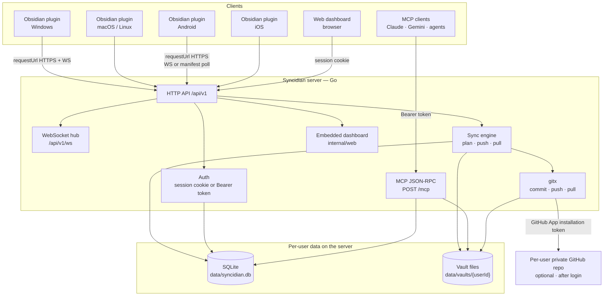

The plugin does not use Node.js or Electron, so the same client runs on phones. Android and iOS call the API with `requestUrl`. If the WebSocket cannot open, they poll `GET /api/v1/sync/manifest`. Desktop and mobile also poll that manifest when the vault window is focused again, so a sleeping socket does not leave notes stale.

---

## 2. Server packages

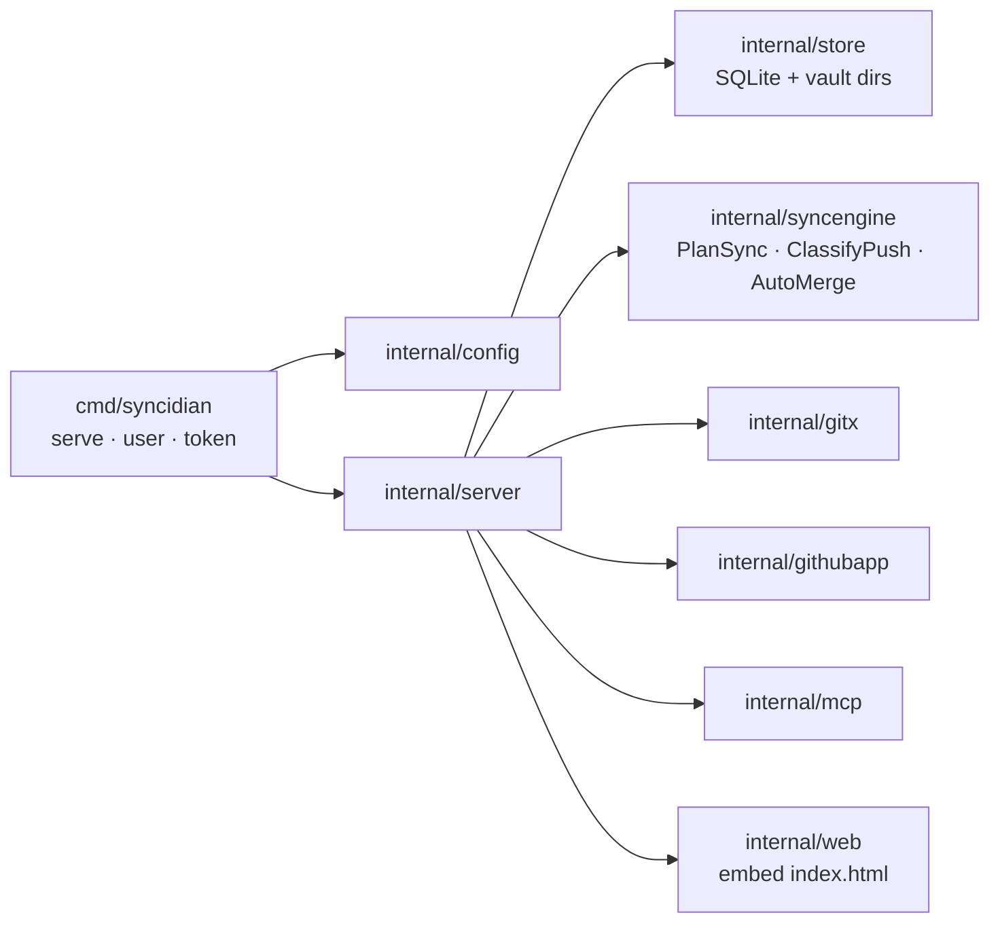

`cmd/syncidian` boots the process. `internal/server` owns HTTP routes, auth, sync, GitHub, WebSocket, and MCP wiring. Persistence lives in `internal/store`. Sync decisions are pure functions in `internal/syncengine` so they can be unit-tested without I/O.

---

## 3. HTTP surface

```mermaid
flowchart TB
  subgraph public [Unauthenticated — public site]
    H["GET /health · /ready"]
    UI["GET /  HTML or text/markdown"]
    AdminUI["GET SYNCIDIAN_ADMIN_PATH<br/>default /admin · unlisted"]
    Robots["GET /robots.txt · /sitemap.xml · /auth.md"]
    Discover["GET /.well-known/api-catalog · mcp/server-card.json<br/>oauth-protected-resource · agent-skills · ai-catalog"]
    OpenAPI["GET /openapi.json"]
    PlugDL["GET /assets/obsidian.zip · /assets/obsidian/*"]
    S1["GET/POST /api/v1/setup"]
    L["POST /api/v1/auth/login · /auth/signup"]
    GHO["GET /api/v1/auth/github/start · /callback"]
    AppPub["GET /api/v1/github/app/setup · /callback<br/>GET/POST /api/v1/github/app/webhook · /urls"]
    MCPLogin["POST /api/v1/mcp/login<br/>password → sk_sync_ token"]
  end

  subgraph session [Dashboard session cookie — after login]
    Me["GET /api/v1/me · /stats"]
    Users["GET/POST /api/v1/users<br/>POST /api/v1/users/tokens<br/>admin: mint one-time sk_sync_"]
    Tokens["GET/POST /api/v1/tokens<br/>vault user only"]
    Dev["devices list · delete"]
    GH["GET/POST /api/v1/github<br/>POST /api/v1/github/app/start"]
    AppAdm["POST /api/v1/github/app/register<br/>admin: instance App"]
    MCPCfg["GET/POST /api/v1/mcp<br/>GET includes usage"]
    Act["GET /api/v1/activity"]
  end

  subgraph plugin [Bearer sk_sync_ token — Obsidian plugin and MCP]
    Reg["POST /api/v1/devices/register"]
    Plan["POST /api/v1/sync/plan"]
    Push["POST /api/v1/sync/push"]
    Conf["conflicts list · get · resolve"]
    File["GET /api/v1/sync/file"]
    Man["GET /api/v1/sync/manifest<br/>also poll if WS down"]
    GHPull["GET /api/v1/github/tree · POST /api/v1/github/sync<br/>GitHub tree is the folder layout"]
    Ticket["POST /api/v1/ws/ticket"]
    Sock["GET /api/v1/ws?ticket="]
    MCP["POST /mcp"]
  end

  public --> session
  session --- plugin
```

Both the dashboard cookie (`syncidian_session`) and the plugin/MCP Bearer token go through `authenticate()`. The public site also advertises itself to AI agents: `GET /` returns markdown when `Accept: text/markdown`, `GET /robots.txt` declares crawl and Content-Signal rules, and `/.well-known/` hosts an API catalog, MCP Server Card, OAuth protected-resource metadata, agent skill index, and ARD `ai-catalog.json`. `GET /auth.md` explains Bearer tokens. Unauthenticated `GET /assets/obsidian/` and `GET /assets/obsidian.zip` serve the three Obsidian sideload files so you can update a local plugin without cloning the repository. DNS-AID records (`_mcp._agents…`) are optional at the DNS host; the app cannot publish them. If Cloudflare AI Crawl Control serves a managed `robots.txt`, disable that override so origin rules are visible. The Obsidian plugin calls the HTTP API with **`requestUrl`** (not browser `fetch`) so Android (`http://localhost` origin) and iOS (`capacitor://localhost`) are not blocked by CORS. Live updates use a WebSocket after `POST /api/v1/ws/ticket`; if the socket cannot connect (cleartext HTTP, iOS ATS), the plugin polls `GET /api/v1/sync/manifest`. The same poll runs when the vault window is focused again so a sleeping desktop or phone socket does not miss notes. Raw `sk_sync_…` values are shown once and stored as SHA-256 hashes. Session cookies are stored hashed too. GitHub App PEM, client secrets, and installation tokens are encrypted at rest (`enc:v1:` AES-256-GCM) with `SYNCIDIAN_DATA_KEY` or `data/secret.key`. Access tokens **cannot** call GitHub connect/disconnect or mint more tokens — those require a dashboard session. They **can** `POST /api/v1/github/sync` so a GitHub-side vault restructure is imported into the working copy before the plugin plans. The plugin identifies itself with `X-Syncidian-Client`; that header is not a security boundary (it is spoofable). Tokens are not accepted in query strings. `GET/POST /api/v1/github` is never public. GitHub App **callback**, **setup**, and **webhook** URLs are public so GitHub can redirect and ping.

---

## 3b. App workflow

This is the user-facing path the dashboard implements. Keep it in sync with `internal/web/static/index.html`.

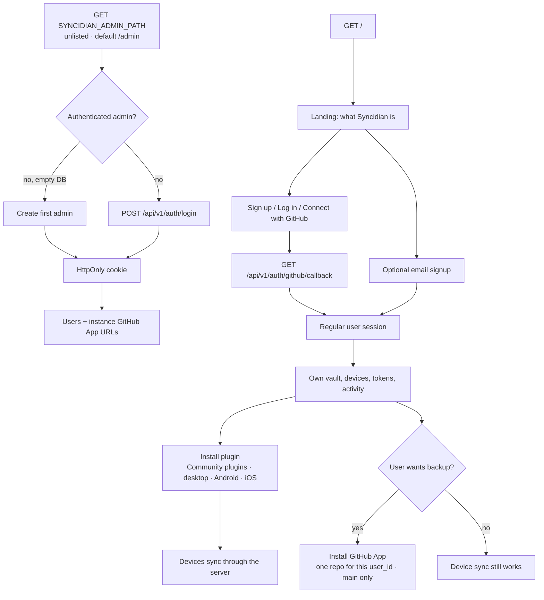

---

## 4. Plugin startup and first sync

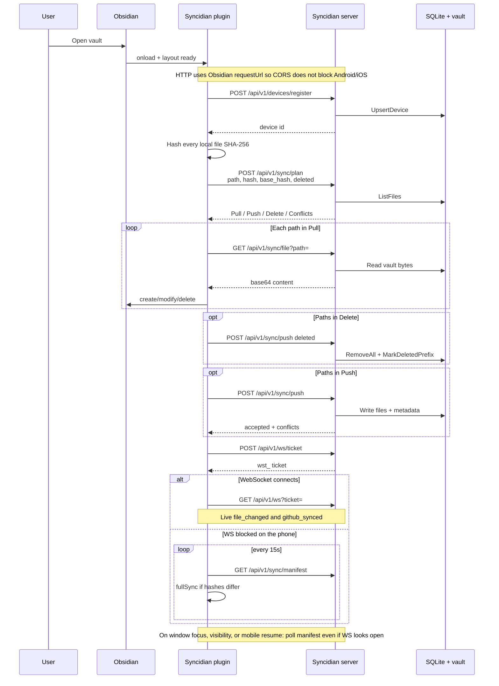

After the first plan/push, the plugin keeps a local `hashes` map (last-known server hash per path). That map is the `base_hash` used on later syncs. Locally deleted files that are still in `hashes` are sent as tombstones so a resync deletes them on the server instead of restoring them. When GitHub is connected, full sync loads **GitHub's file list** (`GET /api/v1/github/tree`), deletes local files that are not in that list (including leftover folders), then imports GitHub onto the server (`POST /api/v1/github/sync`). It will not pull leftover notes back from a stale server copy, and will not push those leftovers back to GitHub.

Returning to Obsidian (desktop window focus, tab visibility, network `online`, or a phone `resume`) runs the same manifest poll. Timers and WebSockets freeze while the app is backgrounded; a socket can stay `OPEN` and still miss `file_changed` events. The 15s poll still runs only when the socket is down.

---

## 5. Editing a note

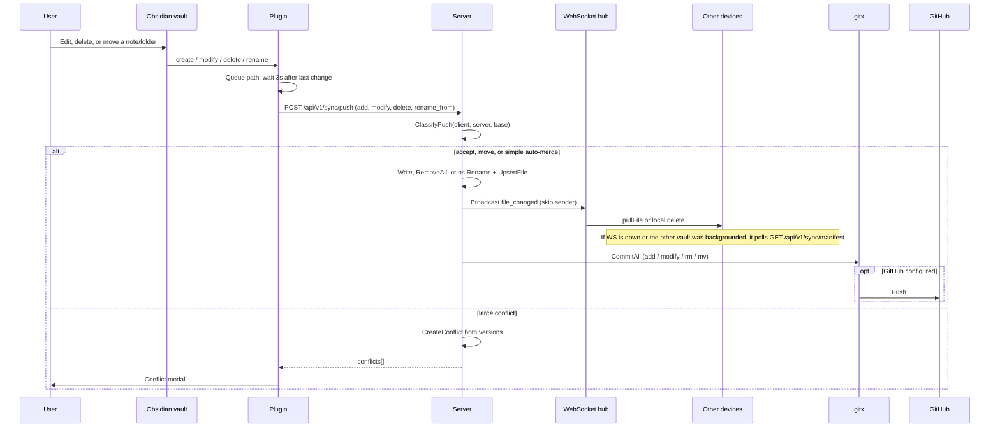

The user never runs git. The plugin never holds GitHub credentials.

---

## 6. Sync plan decisions

`PlanSync` compares three hashes per path: the client's current file, the server's current file, and the client's last-known server hash (`base`). Empty client hashes are local deletes (tombstones). Empty server hashes are server tombstones.

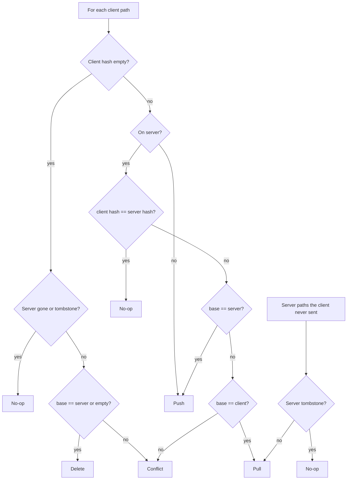

`ClassifyPush` is the write-side counterpart: accept, no-op, or raise a conflict before bytes are written. `AutoMerge` then resolves simple replacements and typing continuations without opening the conflict UI. Folder deletes remove the directory and every descendant file record. File and folder moves are a single push (`renamed_from` plus the new path) so Git records them as a rename, not as a delete followed by an add.

---

## 7. Conflict resolution

Simple replacements and typing continuations merge automatically (`AutoMerge`). The conflict modal opens only when the two versions have large, overlapping differences. A small-LLM resolver is still on the roadmap for ambiguous cases.

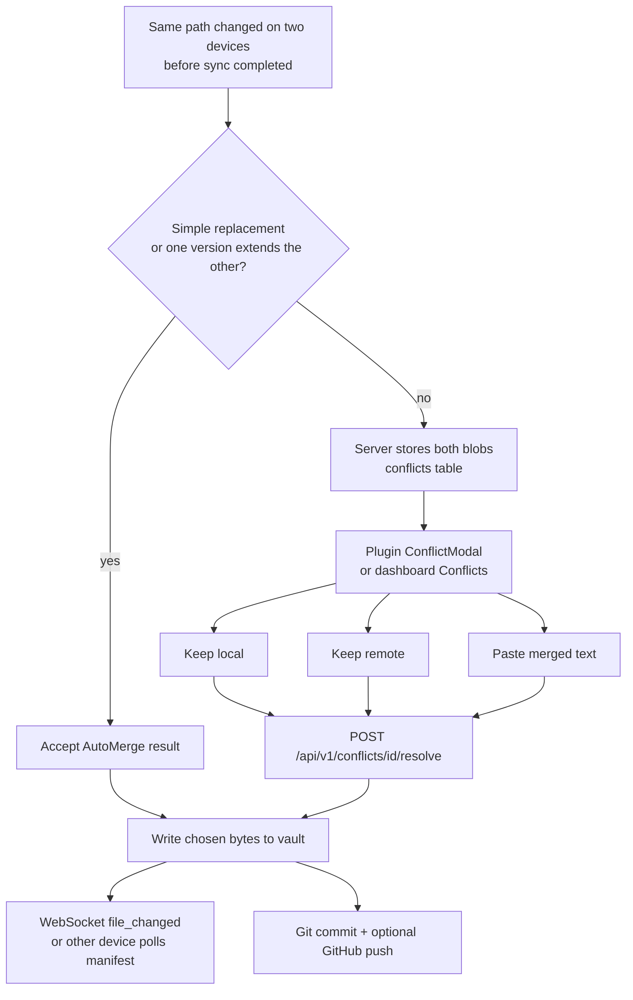

---

## 8. Authentication

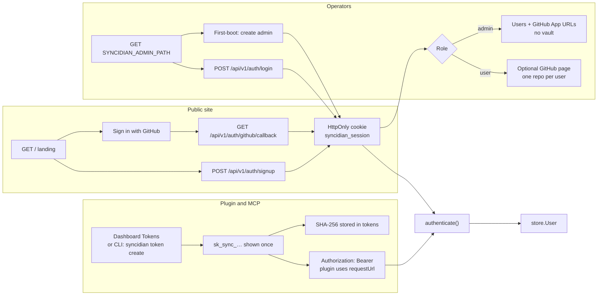

GitHub OAuth is how vault users sign in. Admins sign in on the unlisted operator path (`SYNCIDIAN_ADMIN_PATH`, default `/admin`) with username and password. The instance GitHub App needs a callback URL, a setup URL, and a webhook URL so GitHub can redirect and ping. GitHub App URL paste and MCP/call stats in the dashboard sit behind **Stats for Nerds**.

---

## 9. MCP / AI

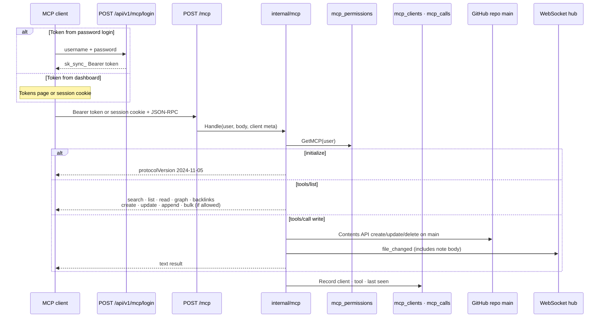

Default permissions are **search + read**. Create and modify are off until the dashboard enables them. `POST /mcp` records the client (`clientInfo` or User-Agent, grouped by access token) and tool-call counts. Overview and **MCP / AI** show connected clients, 24h/7d/all-time call volume, and per-tool usage. Admins never see this.

**Auth:** MCP accepts the same vault Bearer `sk_sync_…` token as the plugin, or a dashboard `syncidian_session` cookie. `POST /api/v1/mcp/login` exchanges username/password for a one-time Bearer token (vault users only; admins are rejected).

**Tools (permission-gated):**

| Permission | Tools |
| --- | --- |
| search | `search_notes`, `list_notes`, `list_files`, `find_related`, `suggest_note_path` |
| read | `read_note`, `get_outgoing_links`, `get_backlinks`, `get_graph` |
| create | `create_note` |
| modify | `update_note`, `add_backlink`, `move_note`, `delete_note`, `bulk_move`, `bulk_add_links` |
| create or modify | `append_to_note` |

Writes go to the user’s GitHub repository (Contents API on `main`), not the server working copy. Connected Obsidian clients receive `file_changed` with the file body (large binaries are pulled over HTTP). `move_note` and `bulk_move` work for any vault file type, including images. `get_graph` returns JSON nodes/edges plus a Mermaid diagram for agents to render. MCP create/update fails until GitHub backup is connected.

---

## 10. Data model

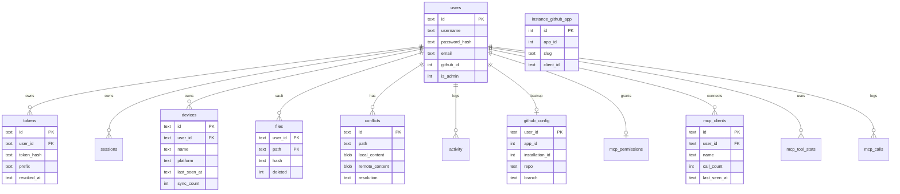

Vault bytes live on disk at `data/vaults/<userId>/` as the working copy (markdown, not encrypted — they are the notes). SQLite (`data/syncidian.db`) stores metadata, auth, devices, conflicts, activity, GitHub config, the instance GitHub App, MCP permissions, connected MCP clients, and MCP call stats. Passwords are bcrypt. Access tokens and session IDs are stored hashed. GitHub App PEM, OAuth client secrets, and installation tokens are AES-256-GCM sealed in those columns.

---

## 11. Multi-user isolation

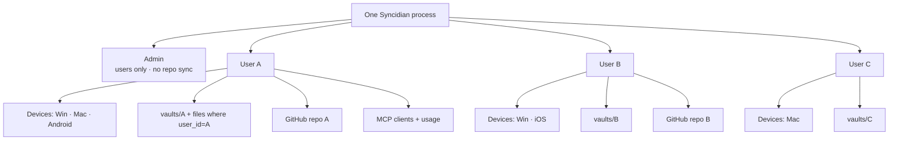

A regular user only sees their own devices, tokens, vault, conflicts, activity, MCP usage, and one GitHub repository. Admins manage accounts and cannot call vault, token, device, activity, MCP, or GitHub APIs. The WebSocket hub broadcasts per `userID`. Devices that cannot keep a socket (typical on some phones) poll `GET /api/v1/sync/manifest` instead. Every device also polls that manifest when Obsidian is foregrounded again.

Admins can create users and list `adminUserSummary` fields (`username`, `is_admin`, `created_at`). They do **not** receive another user's GitHub App credentials, repository, vault bytes, tokens, or activity. Admin login does not require `github_config`.

---

## 12. Deployment

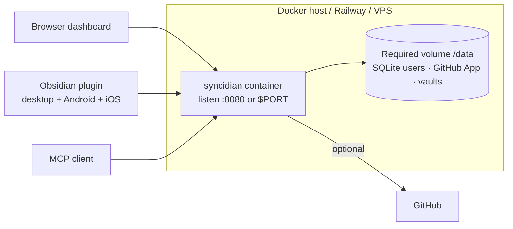

One container. No extra services for the basic install. Users, tokens, the instance GitHub App, per-user GitHub installs, and vault files all live under `SYNCIDIAN_DATA` (SQLite `syncidian.db` plus `vaults/`). A new deploy **replaces the container filesystem**, so that directory must be a named volume.

Railway: mount a volume at `/data`. `railway.json` sets `requiredMountPath` to `/data` (deploys without a volume fail instead of wiping the instance) and `overlapSeconds` to `0` (SQLite is not opened by two replicas during a rollout). The image default `SYNCIDIAN_DATA=/data` no longer hides `RAILWAY_VOLUME_MOUNT_PATH` if the volume is mounted somewhere else. The Dockerfile does not declare `VOLUME` (that broke some builders). `/admin` and `GET /api/v1/setup` report when the data directory looks ephemeral.

---

## Related code

| Area | Path |
| --- | --- |
| Process entry | [`cmd/syncidian/main.go`](../cmd/syncidian/main.go) |
| HTTP routes + auth | [`internal/server/server.go`](../internal/server/server.go), [`internal/server/auth.go`](../internal/server/auth.go), [`internal/server/auth_github.go`](../internal/server/auth_github.go) |
| Agent discovery | [`internal/server/agents.go`](../internal/server/agents.go) (`/robots.txt`, `/auth.md`, `/.well-known/…`) |
| Plan / push / devices | [`internal/server/sync.go`](../internal/server/sync.go) |
| Sync decisions | [`internal/syncengine/plan.go`](../internal/syncengine/plan.go), [`internal/syncengine/merge.go`](../internal/syncengine/merge.go) |
| Git add / modify / rm / mv | [`internal/gitx/repo.go`](../internal/gitx/repo.go) |
| GitHub backup | [`internal/server/github.go`](../internal/server/github.go), [`internal/server/github_app.go`](../internal/server/github_app.go), [`internal/githubapp`](../internal/githubapp) |
| GitHub App self-host setup | [`docs/github-app.md`](github-app.md) |
| MCP tools | [`internal/mcp/`](../internal/mcp/) (`mcp.go`, `links.go`, `organize.go`) |
| Live updates | [`internal/server/ws.go`](../internal/server/ws.go) |
| Persistence | [`internal/store/store.go`](../internal/store/store.go), [`internal/store/crypt.go`](../internal/store/crypt.go), [`internal/config/persist.go`](../internal/config/persist.go), [`railway.json`](../railway.json) |
| Dashboard UI | [`internal/web/static/index.html`](../internal/web/static/index.html) |
| Sideload plugin from the server | [`internal/web/static/assets/obsidian/`](../internal/web/static/assets/obsidian/) (`GET /assets/obsidian/`, `GET /assets/obsidian.zip`) |
| Obsidian plugin (desktop + Android/iOS) | [`plugin/main.ts`](../plugin/main.ts), [`plugin/mobile.ts`](../plugin/mobile.ts), [`plugin/manifest.json`](../plugin/manifest.json) (`isDesktopOnly: false`) |
| Community plugin listing | Root [`manifest.json`](../manifest.json) (must match [`plugin/manifest.json`](../plugin/manifest.json)); GitHub Release **Assets** (`main.js`, `manifest.json`, `styles.css`) via [`.github/workflows/release.yml`](../.github/workflows/release.yml); phone enable steps [`docs/install-mobile.md`](install-mobile.md); packaging notes [`docs/community-plugin.md`](community-plugin.md) |
| Keep diagrams current | [`AGENT.md`](../AGENT.md) |
