# Syncidian architecture

This document describes the **current MVP** as implemented in this repository. GitHub renders the Mermaid diagrams below — open this file on GitHub to visualize them.

The plugin is the client. The Go server is the coordination layer. A per-user vault on disk plus SQLite metadata is the working copy. GitHub is an **optional, per-user** durable source of truth — people sign in with GitHub on the public landing, then install the App on one repository. Operators use `/admin`. MCP is the AI bridge.

When you change this architecture, update the Mermaid diagrams in this file and in `README.md`. See [`AGENT.md`](../AGENT.md).

---

## 1. System overview

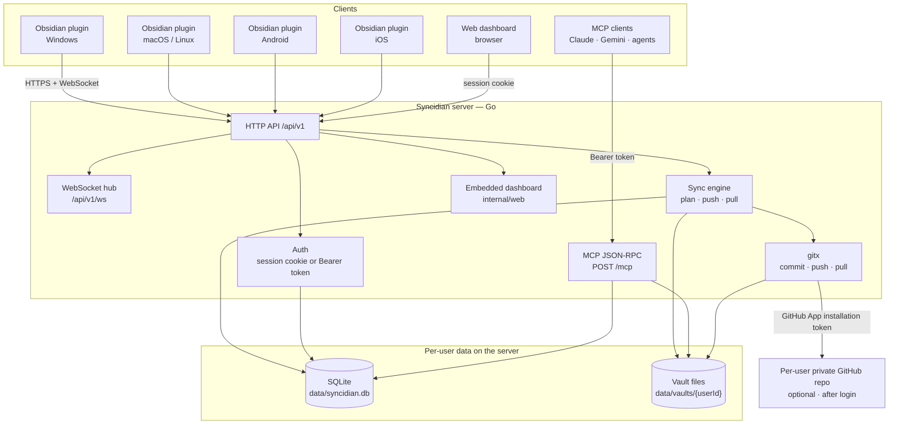

---

## 2. Server packages

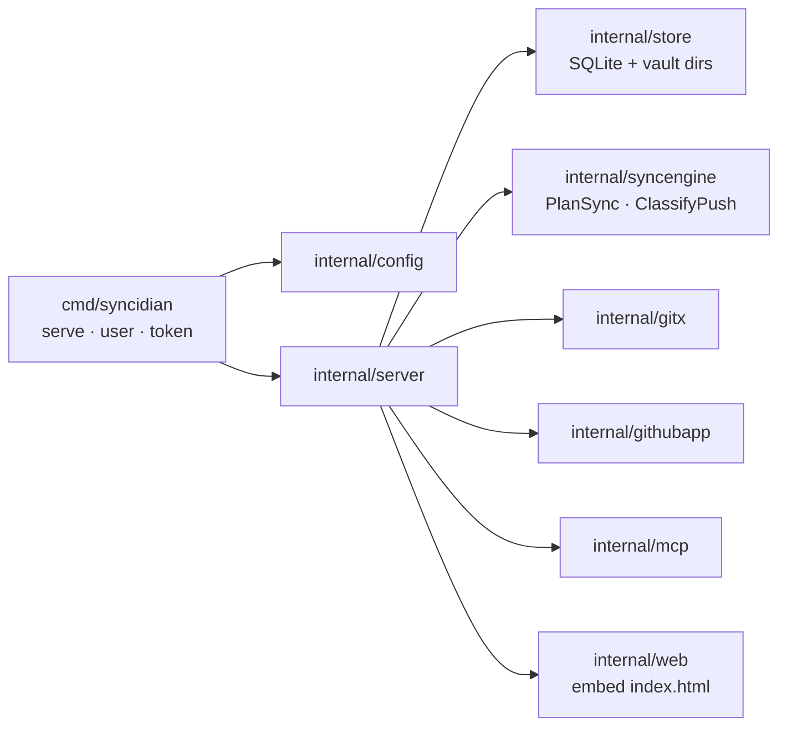

`cmd/syncidian` boots the process. `internal/server` owns HTTP routes, auth, sync, GitHub, WebSocket, and MCP wiring. Persistence lives in `internal/store`. Sync decisions are pure functions in `internal/syncengine` so they can be unit-tested without I/O.

---

## 3. HTTP surface

```mermaid
flowchart TB
  subgraph public [Unauthenticated — public site]
    H["GET /health · /ready"]
    UI["GET /  → one-page landing"]
    AdminUI["GET /admin → admin sign-in / first setup"]
    S1["GET/POST /api/v1/setup"]
    L["POST /api/v1/auth/login · /auth/signup"]
    GHO["GET /api/v1/auth/github/start · /callback"]
    AppPub["GET /api/v1/github/app/setup · /callback<br/>GET/POST /api/v1/github/app/webhook · /urls"]
  end

  subgraph session [Dashboard session cookie — after login]
    Me["GET /api/v1/me · /stats"]
    Users["GET/POST /api/v1/users<br/>admin: public fields only"]
    Tokens["GET/POST /api/v1/tokens"]
    Dev["devices · heartbeat"]
    GH["GET/POST /api/v1/github<br/>POST /api/v1/github/app/start"]
    AppAdm["POST /api/v1/github/app/register<br/>admin: instance App"]
    MCPCfg["GET/POST /api/v1/mcp"]
    Act["GET /api/v1/activity"]
  end

  subgraph plugin [Bearer sk_sync_ token]
    Reg["POST /api/v1/devices/register"]
    Plan["POST /api/v1/sync/plan"]
    Push["POST /api/v1/sync/push"]
    File["GET /api/v1/sync/file"]
    Man["GET /api/v1/sync/manifest"]
    Conf["conflicts list · get · resolve"]
    Sock["GET /api/v1/ws"]
    MCP["POST /mcp"]
  end

  public --> session
  session --- plugin
```

Both the dashboard cookie (`syncidian_session`) and the plugin/MCP Bearer token go through the same `authenticate()` path. Tokens are stored as SHA-256 hashes; the raw `sk_sync_…` value is shown once. `GET/POST /api/v1/github` is never public — unauthenticated callers receive 401. GitHub App **callback**, **setup**, and **webhook** URLs are public so GitHub can redirect and ping.

---

## 3b. App workflow

This is the user-facing path the dashboard implements. Keep it in sync with `internal/web/static/index.html`.

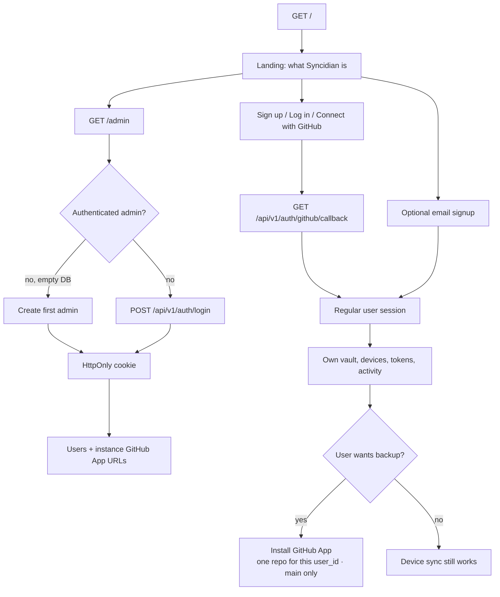

---

## 4. Plugin startup and first sync

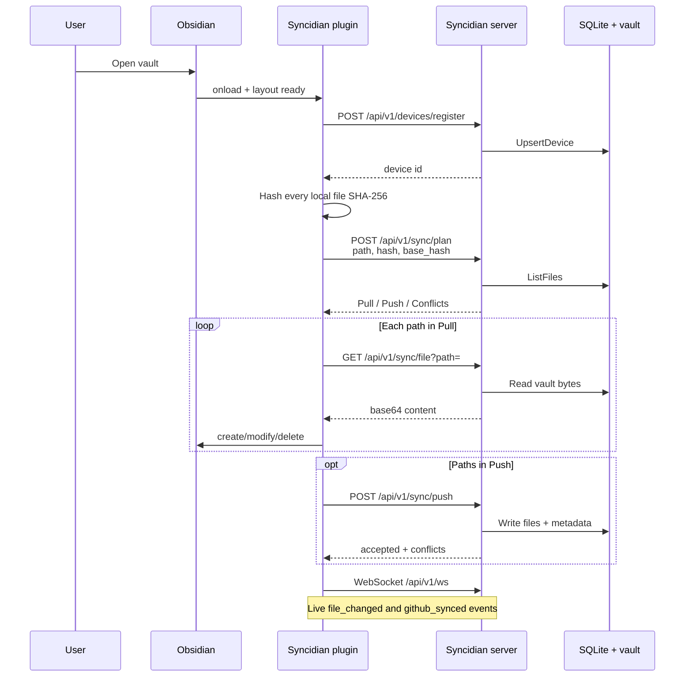

After the first plan/push, the plugin keeps a local `hashes` map (last-known server hash per path). That map is the `base_hash` used on later syncs.

---

## 5. Editing a note

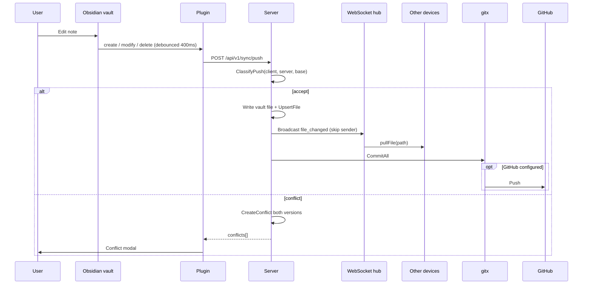

The user never runs git. The plugin never holds GitHub credentials.

---

## 6. Sync plan decisions

`PlanSync` compares three hashes per path: the client's current file, the server's current file, and the client's last-known server hash (`base`).

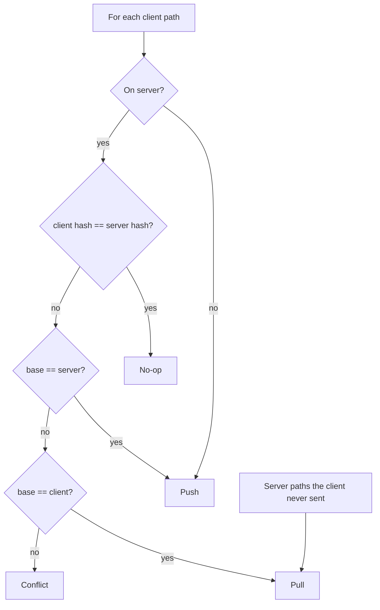

`ClassifyPush` is the write-side counterpart: accept, no-op, or raise a conflict before bytes are written.

---

## 7. Conflict resolution

The first version is human-in-the-loop. A small-LLM auto-resolver is on the roadmap, not in this MVP.

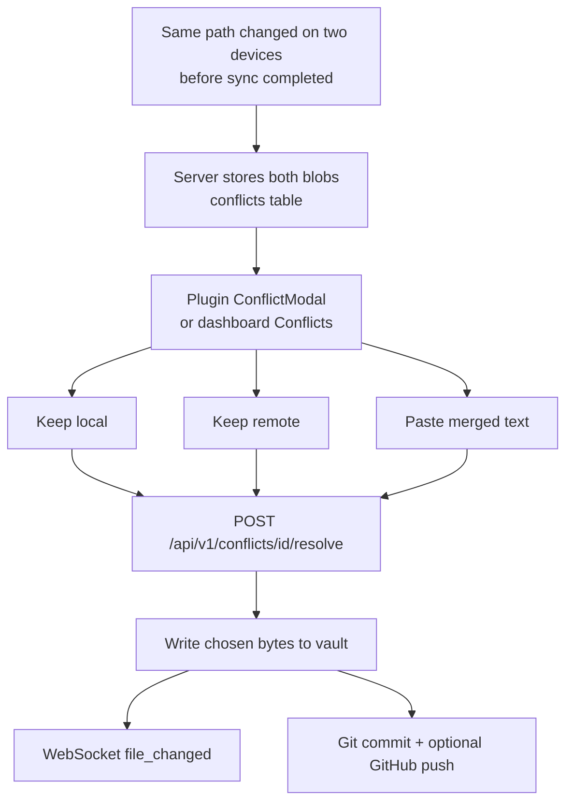

---

## 8. Authentication

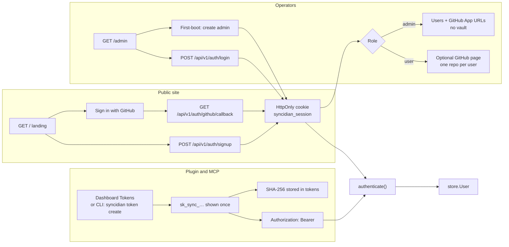

GitHub OAuth is how vault users sign in. Admins sign in at `/admin` with username and password. The instance GitHub App needs a callback URL, a setup URL, and a webhook URL so GitHub can redirect and ping.

---

## 9. MCP / AI

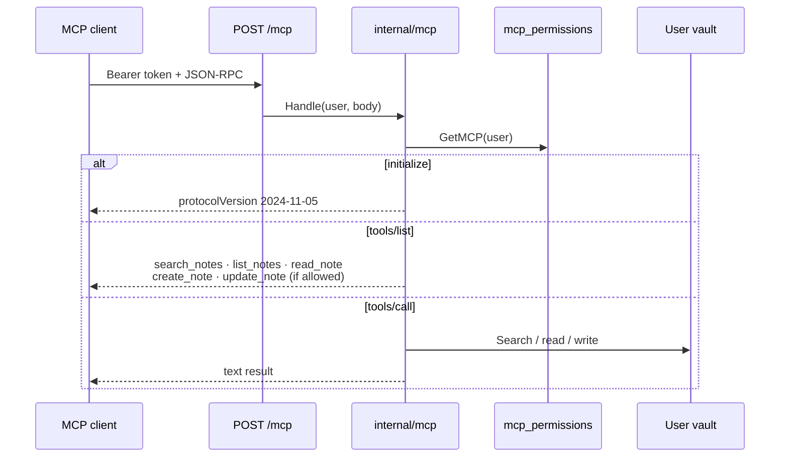

Default permissions are **search + read**. Create and modify are off until the dashboard enables them.

---

## 10. Data model

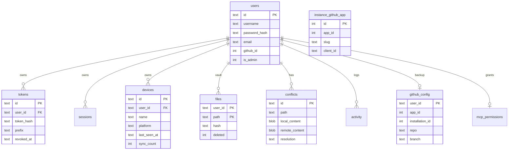

Vault bytes live on disk at `data/vaults/<userId>/`. SQLite (`data/syncidian.db`) stores metadata, auth, devices, conflicts, activity, GitHub config, the instance GitHub App, and MCP permissions.

---

## 11. Multi-user isolation

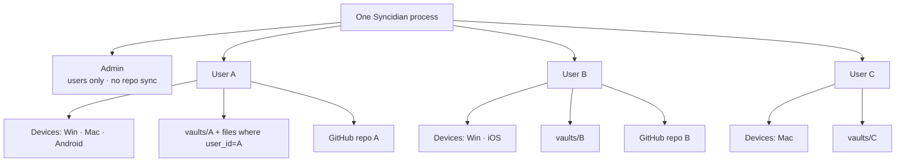

A regular user only sees their own devices, tokens, vault, conflicts, activity, and one GitHub repository. Admins manage accounts and cannot call vault, token, device, activity, or GitHub APIs. The WebSocket hub broadcasts per `userID`.

Admins can create users and list `adminUserSummary` fields (`username`, `is_admin`, `created_at`). They do **not** receive another user's GitHub App credentials, repository, vault bytes, tokens, or activity. Admin login does not require `github_config`.

---

## 12. Deployment

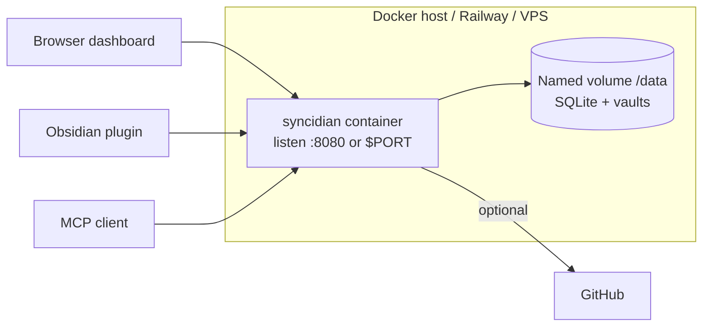

One container. No extra services for the basic install. Railway mounts a volume at `/data`; the Dockerfile does not declare `VOLUME` (that broke some builders).

---

## Related code

| Area | Path |
| --- | --- |
| Process entry | [`cmd/syncidian/main.go`](../cmd/syncidian/main.go) |
| HTTP routes + auth | [`internal/server/server.go`](../internal/server/server.go), [`internal/server/auth.go`](../internal/server/auth.go), [`internal/server/auth_github.go`](../internal/server/auth_github.go) |
| Plan / push / devices | [`internal/server/sync.go`](../internal/server/sync.go) |
| Sync decisions | [`internal/syncengine/plan.go`](../internal/syncengine/plan.go) |
| GitHub backup | [`internal/server/github.go`](../internal/server/github.go), [`internal/server/github_app.go`](../internal/server/github_app.go), [`internal/githubapp`](../internal/githubapp), [`internal/gitx/repo.go`](../internal/gitx/repo.go) |
| GitHub App self-host setup | [`docs/github-app.md`](github-app.md) |
| MCP tools | [`internal/mcp/mcp.go`](../internal/mcp/mcp.go) |
| Live updates | [`internal/server/ws.go`](../internal/server/ws.go) |
| Persistence | [`internal/store/store.go`](../internal/store/store.go) |
| Dashboard UI | [`internal/web/static/index.html`](../internal/web/static/index.html) |
| Obsidian plugin | [`plugin/main.ts`](../plugin/main.ts) |
| Keep diagrams current | [`AGENT.md`](../AGENT.md) |
